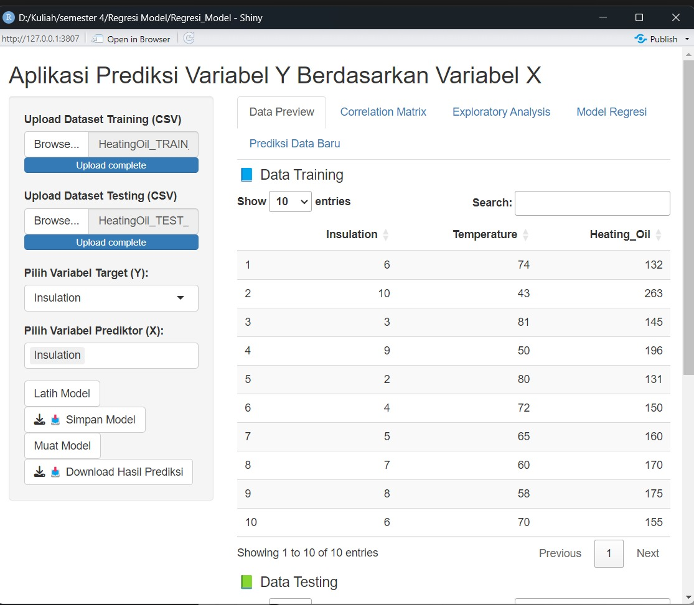
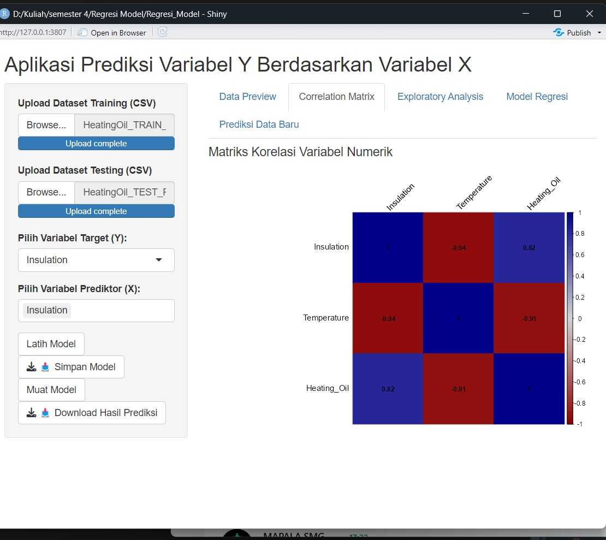
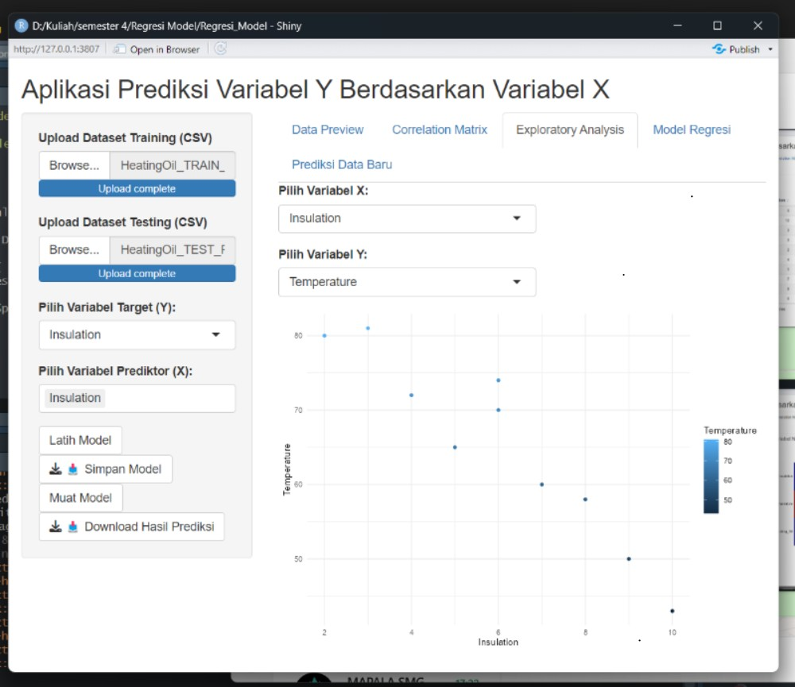
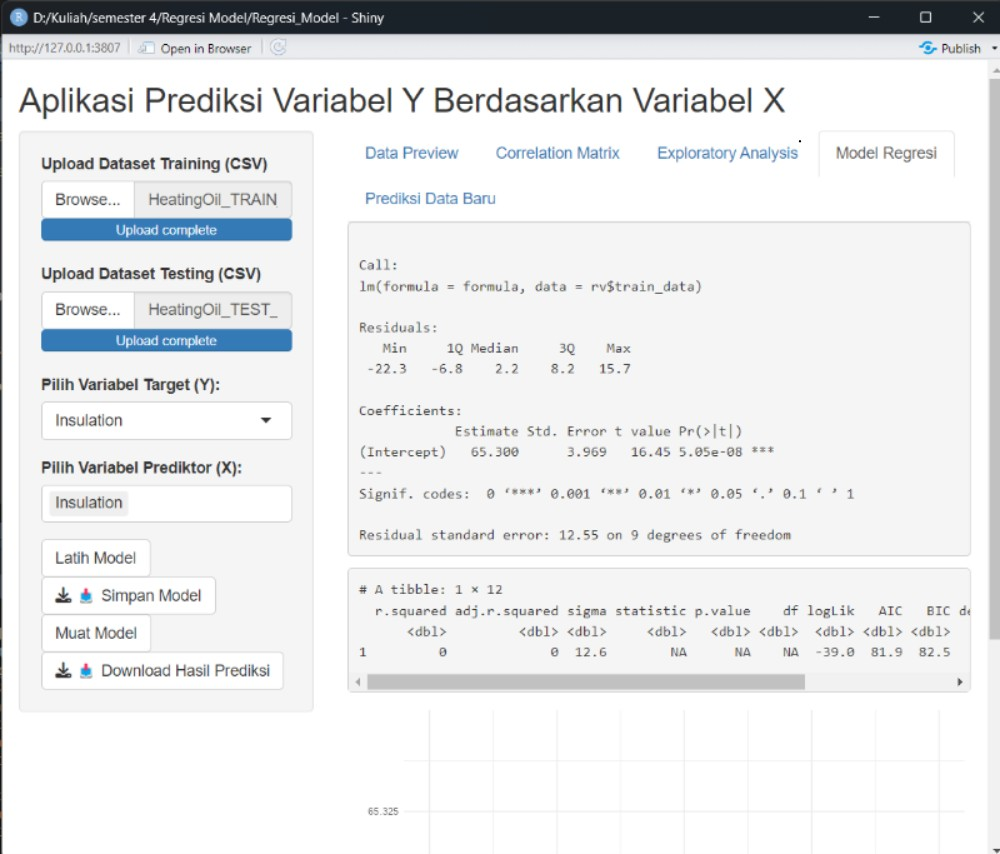
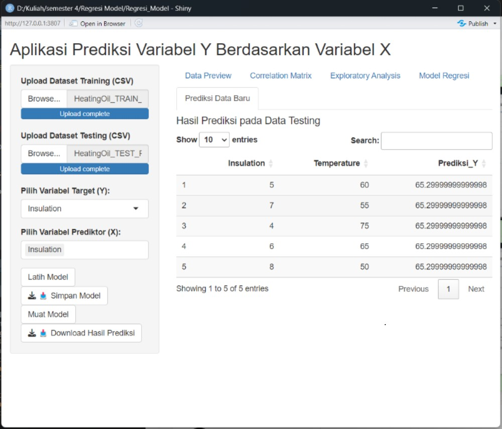

### 1. Data Preview

Bagian ini menyajikan pratinjau awal data. Pengguna dapat melihat beberapa baris pertama dari dataset yang diunggah, termasuk nama kolom dan tipe data. Hal ini penting untuk memverifikasi bahwa data sudah dimuat dengan benar dan dalam format yang sesuai untuk analisis lanjutan.
```{r}

```{r, echo=FALSE, out.width='50%'}

```
---

### 2. Correlation Matrix


Pada bagian ini, aplikasi menghitung dan menampilkan matriks korelasi antar variabel, terutama untuk mengidentifikasi kekuatan hubungan antara variabel **X dan Y**. Korelasi ditampilkan dalam bentuk tabel dan heatmap, sehingga memudahkan pengguna dalam menginterpretasi hubungan linier antar variabel.

```{r}

```{r, echo=FALSE, out.width='50%'}

```

---

### 3. Exploratory Analysis

Fitur eksplorasi data memungkinkan pengguna memahami karakteristik dataset melalui berbagai visualisasi seperti **histogram**, **boxplot**, dan **scatter plot**. Ini bertujuan untuk mengidentifikasi distribusi data, outlier, serta pola hubungan yang penting sebelum membangun model prediktif.

```{r}

```{r, echo=FALSE, out.width='50%'}

```

---

### 4. Model Regresi

Pada bagian ini, pengguna dapat membangun model regresi linier berdasarkan data training yang telah dipisahkan dari data testing. Aplikasi menyajikan ringkasan model yang mencakup nilai koefisien, p-value, R-squared (R²), serta metrik kesalahan seperti RMSE. Ini berguna untuk mengevaluasi performa dan signifikansi model yang dibangun.

```{r}

```{r, echo=FALSE, out.width='50%'}

```
---

### 5. Prediksi Data Baru

Fitur ini memungkinkan pengguna memasukkan nilai variabel **X** baru untuk memprediksi nilai **Y** berdasarkan model yang telah dilatih. Hasil prediksi ditampilkan secara langsung dan dapat dibandingkan dengan data sebenarnya jika tersedia.


```{r}

```{r, echo=FALSE, out.width='50%'}

```
---

### Alur Penggunaan Aplikasi

1. Pengguna mengunggah dataset (dalam format CSV).
2. Aplikasi menampilkan pratinjau data.
3. Pengguna dapat mengecek hubungan antar variabel melalui korelasi.
4. Eksplorasi dilakukan dengan visualisasi data.


---

### Fungsionalitas Utama

- Mendukung upload data kustom.
- Menampilkan ringkasan statistik dan visualisasi eksploratif.
- Membangun dan mengevaluasi model regresi.
- Menyimpan dan memuat model (menggunakan `saveRDS()` dan `readRDS()`).
- Mendukung input data prediksi baru secara manual.

---

### Penutup

Aplikasi ini bermanfaat bagi pengguna yang ingin melakukan analisis prediktif sederhana secara cepat dan intuitif, tanpa harus menulis banyak kode. Semua langkah, mulai dari eksplorasi data hingga prediksi, terintegrasi dalam satu alur kerja yang sistematis dan mudah dipahami.